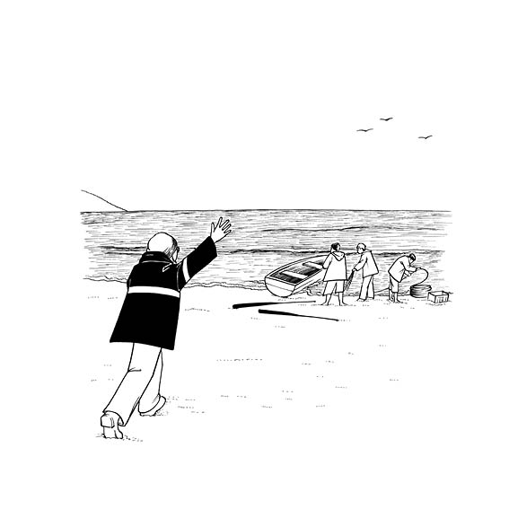
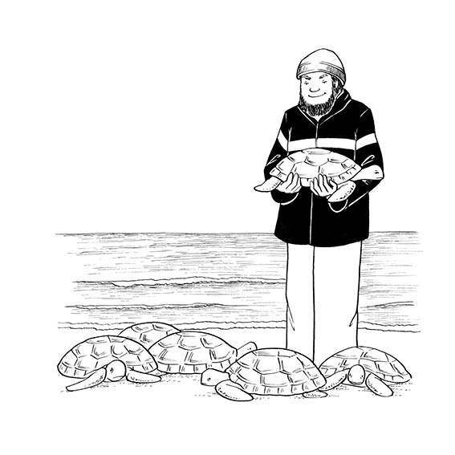
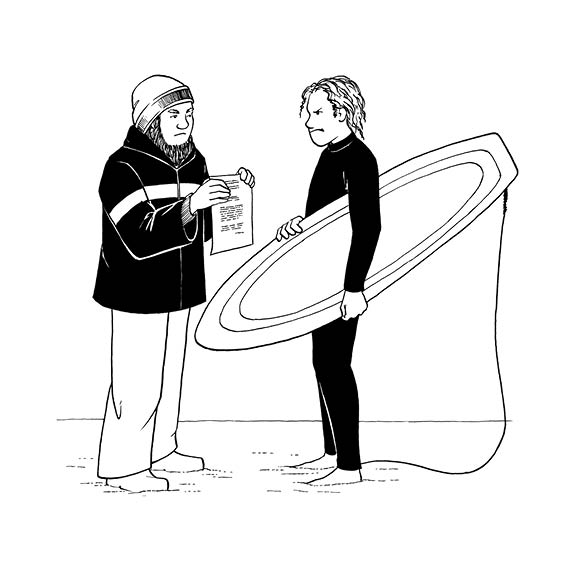

# Intlanzi kunye nesipho

Ngomnye uLwesihlanu okhethekileyo utata kaYusuf wanxiba phambi kokuba kuthi qheke ukukhanya esibhakabhakeni. Wazithi wanmbu ngesikhwehle sakhe kunye nomnqwazi wakhe wewulu oluhlaza wokogquma iindlebe. Wawangawangisa ebhabhayisa kunyana wakhe. Amehlo kaYusuf abengezela lulonwabo xa uPapa esithi, “Namhlanje yimini endiza kubamba ngayo intlanzi ndize ndikuphatele nesipho.”

Intlanzi kunye nesipho? Owu, kazi siza kuba yintoni? UPapa waqhuba ibhayisekile esehla ngendela eya eMuizenberg. Tshixi, tshixi, angxola njalo amavili ukuya kutshona eSurfer’s Corner.

Amangabangaba ayejikeleza esibhakabhakeni. “Wha-a-a! Wha-a-a! Wha-a-a!” akhala njalo. “Uza kumphathela ntoni uYusuf?”

UPapa wakhalisa uphondo lwebhayisekile yakhe. “Lindani niza kubona ukuba iza kuba yintoni na!”

Abalobi babukele ilanga lisenyuka. Bakhangela iminatha yabo ukuba imi kakuhle kusini na. Bakhangela amaphini abo okuqhuba izikhitshana. Bamamela ukuba uvela ngaphi na umoya. Batsala izikhitshana zabo bezifaka emanzini. Utat’omkhulu kaYusuf, uTa’mkhul’ uSalie, wayengumlobi oloba ngokutsala umnatha emva kwesikhitshane. Phambi kwakhe, utata wakhe, uTa’mkhul’uRidwaan, wayelwazi naye ulwandle. 

Isikhitshana saya phambili siqhutywa ngamaza. Iingalo zikaPapa zabamba iphini lokuqhuba isikhitshane. Umlenze wakhe waxhathisa ecaleni lesikhitshane. Intamo yakhe yatsaleka, nezihlunu zakhe zahukuma.

UPapa wayecula lo gama asebenzayo, “Yihla uze uthi swahla. Fumana iintlanzi. Tsala macala onke. Ungayeki.”

Yonke loo mini uYusuf wayejonge sibhakabhakeni. Sasiluhlaza, kungekho nalinye ilifu nomoya ungekho. Intlanzi kunye nesipho! Uza kundiphathela ntoni bethu uPapa elwandle? Ngamanye amaxesha undiphathela unokrwece omhle. Maxa wambi andiphathela ibhotilana eluhlaza yamaso etyekezwe ngamaza.

Ngezinye iintsuku utata kaYusuf uza nebali. Njengalaa mini babefumene ngayo amafudo aselwandle entlabathini, amakhulu-khulu amafudo etyekezwe lulwandle emva kwesiphango.

“Wha-a-a! Wha-a-a! Wha-a-a!” akhala njalo amangabangaba. “Uza kwenza ntoni enokunceda amafudo aselwandle?”

UPapa wathi, “Siwasindisile loo mafudo, ndiyakuxelela. Siwabuyisele elwandle kwakhona, nditsho nelokugqibela.”

Ngalo lonke ixesha uPapa ubuya nengoma. Ucula ingoma lo gama etsala iphini lokuqhuba isikhitshane. Ucula ingoma lo gama etsala iminatha yokuloba. Ucula ingoma xa asonga iintambo. Ucula ingoma njengokuba enyova ibhayisekile yakhe, egoduka. “Yihla uze uthi swahla. Fumana iintlanzi. Tsala macala onke. Ungayeki.”

UMakhulu uSafiya ufuna intlanzi i-yellowtail emnandi netyebileyo yesidlo sangokuhlwa. UMama ufuna ilokhwe entle.

“Musa ukufane ube nethemba,” utsho uMakhulu. “Uya kuba unethamsanqa ukuba babambe unonkala omncinane. Mhlawumbi ingade ibe nguLwesihlanu we-fish tail lo. Akusekho zintlanzi zininzi ziseleyo elwandle.”

UYusuf ubamba isandla sikaMakhulu. Bawela indlela ngakumagunjana okuhlamba. “Wha-a-a! Wha-a-a! Wha-a-a!” kukhala amangabangaba ethe ngcu phezu kwamaphahla anemibala eqaqambileyo. “Yintoni isidlo sangokuhlwa?”

Kunyaka ophelileyo abalobi balwa nabadlali ababaleka ngebhodi phezu kwamaza.

“Wha-a-a! Wha-a-a! Wha-a-a!” kukhala amangabangaba. 

“Ulwandle lonele wonke umntu,” watsho utata kaYusuf. Wababonisa abadlali iphepha-mvume yokuloba eyayiyekaTat’omkhulu uSalie. “Amanza ngawomntu wonke. Amanzi asimahla.”

UMakhulu uSafiya ujonge ngoomabonakude bakhe, iminwe yakhe ide yagoba kukufuna ukwazi. Intsimbi elumkisa ngobukho bukakrebe iyakhala. Abaqubhayo babaleka baphume elwandle, bathathe iitawula zabo. Abadlali ngeebhodi kumaza baza elunxwemeni nabo, bethe khu phantsi kweengalo zabo ibhodi zabo zokukhwela kumaza. Phantsi kweeshawa bakhulula iimpahla zabo zokudada. 

“Wha-a-a! Wha-a-a! Wha-a-a!” kukhala amangabangaba. “Uza kubuya nantoni utata kaYusuf elwandle?”

Utata kaYusuf npmalume kunye nabazala bakhe bayakhefuzela bayatsala. Ukrebe omncinane ubanjisiwe. Uyabhinyalaza ezibethekisa emazeni. Utata kaYusuf ukhulula ukuphithana kweminatha, eculela ukrebe, “Yihla uze uthi swahla. Fumana intlanzi. Tsala macala onke. Ungayeki.”

Ekugqibeleni xa ukrebe ekhululekile, edada ukubuyelaelwandle, kushiyeka kuphela intlanzi enya etyebileyo yohlobo lwe-yellowtail. UMakhulu uSafiya uza kuvuya.

Amadoda atsala isikhitshane azeasonge iintambo. Unxantathu onzima nomhlophe ubambisa umnwe kaPapa.

Wha-a-a! Wha-a-a! Wha-a-a! kukhala amangabangaba. “Umphathele ntoni uYusuf?”

Njengokuba ilanga lisiya litshona, uPapa uphendula amangabangaba, “Ndiphathele unyana wam izinyo lethamsanqa likakrebe.”

Ekhaya uYusuf uphakamisela isipho sakhe phezulu, ezinkwenkwezini.
