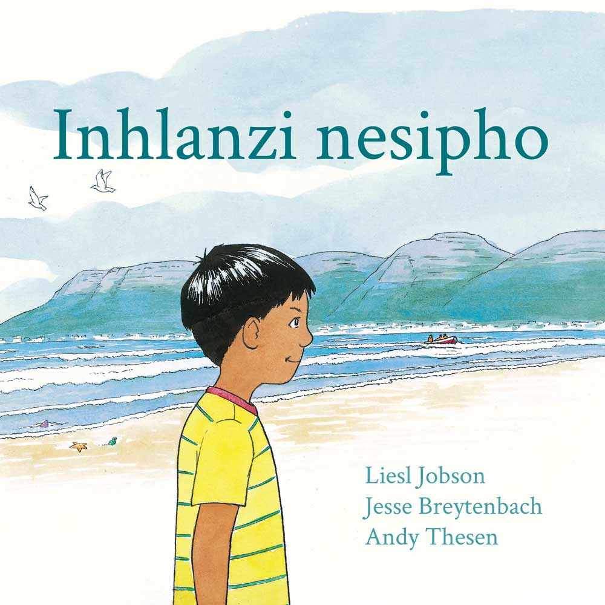
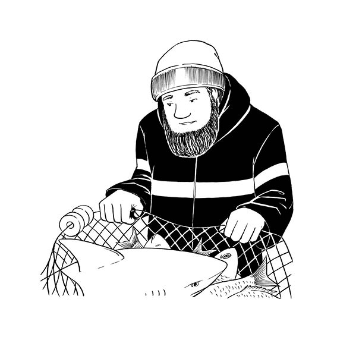
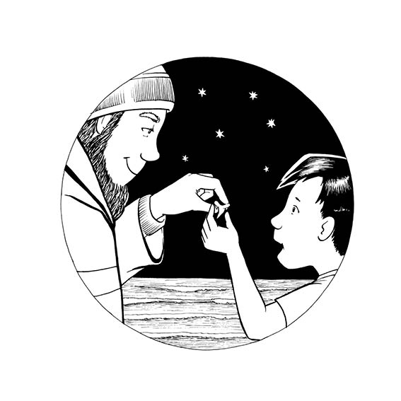

{:.page-break-after}

Ngolunye uLwesihlanu olukhethekile, ubaba
kaYusuf uyagqoka ngaphambi kokuba kube
nokukhanya okukhanyisa isibhakabhaka. Ugqoka
ibhantshi lakhe lokumvikela ezimeni ezahlukene
zezulu kanye nekepisi lewuli elimboza izindlebe
zakhe. Uvalelisa umfana wakhe. Amehlo kaYusuf
ayakhanya ngesikhathi uBaba ethi, “Lolu usuku
lapho ngizobamba khona inhlanzi bese futhi ngiza
nesipho sakho ekhaya.”

{:.page-break-after}

Inhlanzi kanye nesipho? O, kazi kuzoba yini? 
UBaba wehla ngebhayisikili eqonde eMuizenberg
Beach. Nsege-nsege, kukhala amasondo,
eshosholoza ebheke e-Surfer’s Corner.
Izinyoni zasolwandle zizungeza esibhakabhakeni.
“Ini-i-i? Ini-i-i? Ini-i-i?” kukhala zona.
“Uzomphathelani uYusuf?”
UBaba ushaya insimbi yakhe. “Lindani ukuze
nibone ukuthi kuzoba yini!”

{:.page-break-after}

Abadobi babheka ukuphuma kwelanga.
Bahlola amanethi abo. Babheka namaphini
okugwedla abo. Balalela umoya. Badonsa
izikebhe zabo bazifake emanzini. Umkhulu
kaYusuf, uMkhulu uSalie, wayengumdobi
odoba ngamanethi. Ngaphambi kwakhe,
uBaba kaMkhulu wakhe uRidwaan, naye
wayelwazi ulwandle.

{:.page-break-after}

Isikebhe singena emagagasini. Izingalo
zikaBaba zelulekela emaphinini okugwedla.
Umlenze wakhe ugaxele ngasohlangothini
lwesikebhe. Intambo yakhe iyadonseka,
izinyama zakhe zasemhlane ziyanyakaza.
UBaba uyacula ngesikhathi esebenza, “Yehlisa
bes’ uyaluzisa. Thol’ inhlanzi. Donsa-ke bes’
uyibamba. Ungab’ usayeka.”

{:.page-break-after}

Usuku lonke uYusuf ubheka esibhakabhakeni.
Siyakhanya, asinamafu futhi akukho moya.
Inhlanzi kanye nesipho! Kazi uBaba uzobe
ephetheni lapho ebuya olwandle? Uke aphathe
igobolondo elihle. Ngesinye isikhathi kuba
yibhodlela eliluhlaza okotshani
elihlanzwe amagagasi.

{:.page-break-after}

Ngezinye izinsuku ubaba kaYusuf uza nendaba.
Njengalapho bathola khona izimfudu zasolwandle
esihlabathini, amakhulu azo ekhafulwe ulwandle
ngenxa yesiphepho.
“Ini-i-i? Ini--i? Ini-i-i?” kukhala izinyoni zasolwandle.
“Nizokwenzani ukuze nisize izimfudu?”
UBaba wathi, “Sazihlenga lezo zimfudu,
ngizokutshela nje ngingakufihleli. Sazibuyisela
olwandle, ngisho nolokugcina imbala.”

{:.page-break-after}

Text: "Always Papa brings a song..."

{:.page-break-after}

UGogo uSafiya ufuna inhlanzi,
‘umsilophuzi’, emnandi ekhuluphele
esidlweni sakhe sakusihlwa. UMama ufuna
ingubo entsha.
“Ungazikhohlisi,” kusho uGogo.
“Uzobe unenhlanhla uma engabamba
nenkalankalana yodwa le. Akusaphathwake
njengoba kungoLwesihlanu lokudoba
izinhlanzi nje, okuthiwa ‘olwemisila yezinhlanzi’. 
Akusenazinhlanzi eziningi ezingatholakala olwandle.”
UYusuf ubamba isandla sikaGogo. Banqamula
umgwaqo ezindlwaneni zababhukudayo.
“Ini-i-i? Ini-i-i? Ini-i-i?” kukhala izinyoni
zasolwandle zihlezi phezu kophahla olunombala
ogqamile. “Sizoba yini isidlo sakusihlwa?

{:.page-break-after}

Ngonyaka odlule abadobi balwa nabantweza
ngamabhodi emanzini.
“Ini-i-i? Ini-i-i? Ini-i-i?” kukhala
izinyoni zasolwandle.
“Ulwandle lubanzi, lwanele wonke umuntu,”
kusho uBaba kaYusuf. Wabakhombisa
imvume yokudoba okwakungekaMkhulu
uSalie. “Amagagasi ngawabo bonke abantu.
Amanzi amahhala.”

{:.page-break-after}

UGogo uSafiya ubuka ngezibukakude
zakhe, iminwe yakhe igobile, akasakwazi
nokulinda. Kukhala insimbi exwayisa
ngoshaka. Abebebhukuda babalekela
esihlabathini bathathe amathawula abo.
Abebentweza ngamabhodi babalekela
osebeni begodle amabhodi abo. Bageza
emashaweni bese bekhumula izingubo zabo
zokuhlamba ezimanzi.
“Ini-i-i? Ini-i-i? Ini-i-i?” kukhala izinyoni
zasolwandle. “Ngabe uBaba kaYusuf uzoya
nani ekhaya oluphuma olwandle?”

{:.page-break-after}

Ubaba kaYusuf nomalume wakhe kanye nabazala
bakhe bayabamba bese bedonsa. Kukhona ushaka
omncane obambekile. Uyaphenduphenduka bese
uzishayisa emagagasini. Ubaba kaYusuf uthukulula
amanethi, eculela ushaka, “Yehlisa bes’ uyaluzisa. Thol’
inhlanzi. Donsa-ke bes’ ubamba. Ungab’ usayeka.”
Ekugcineni lapho ushaka usukhululekile utshuza
ubuyele emagagasini, ushiya umsilophuzi owodwa
okhuluphele enethini. Akeve ezojabula uGogo Safiya!

{:.page-break-after}

Amadoda akhipha isikebhe emanzini bese esonga
amakhebuli. Bese kuba khona okusanxantathu okuqinile
okumhlophe okubambeka emunweni kaBaba.
“Ini-i-i? Ini-i-i? Ini-i-i?” kukhala izinyoni zasolwandle.
“Umphatheleni uYusuf?”
Lapho kushona ilanga, uBaba uphendula izinyoni
zasolwandle, “Izinyo likashaka eliletha inhlanhla
lomfana wami.”
Ekhaya uYusuf uphakamisa isipho sakhe
asibhekise ezinkanyezini.

{:.page-break-after}

{:.imprint-logo}
{:.page-break-before}

*Inhlanzi Nesipho*  
Illustrated by Jesse Breytenbach 
Written by Liesl Jobson
Designed by Andy Thesen
with the help of the [Book Dash participants at Cape Town on 10 May 2014](http://bookdash.org/20140510-cape-town).  
ISBN: 978-0-9946520-4-1  
This work is licensed under a [Creative Commons Attribution 4.0 Licence](http://creativecommons.org/licenses/by/4.0/). You are free to share (copy and redistribute the material in any medium or format) and adapt (remix, transform, and build upon the material) this work for any purpose, even commercially. The licensor cannot revoke these freedoms as long as you follow the following license terms:  
Attribution: You must give appropriate credit, provide a link to the license, and indicate if changes were made. You may do so in any reasonable manner, but not in any way that suggests the licensor endorses you or your use.  
No additional restrictions: You may not apply legal terms or technological measures that legally restrict others from doing anything the license permits.  
Notices: You do not have to comply with the license for elements of the material in the public domain or where your use is permitted by an applicable exception or limitation.  
No warranties are given. The license may not give you all of the permissions necessary for your intended use. For example, other rights such as publicity, privacy, or moral rights may limit how you use the material.
{:.imprint-text}
