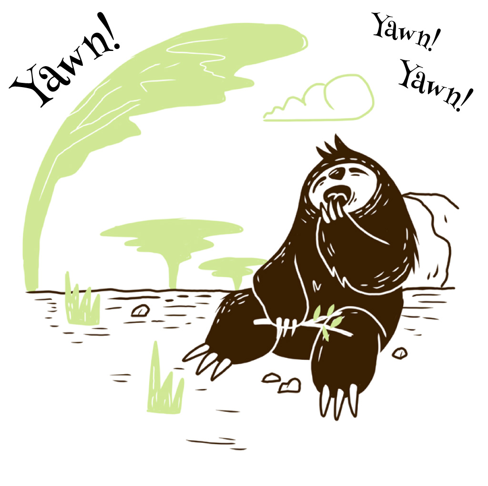

{:.page-break-after}

One day, Mr Sloth came  
to visit. He said:  
I’m sleepy! I need a good  
branch for a bed!

{:.page-break-after}

I’m quite good at climbing.  
I know how to swing.  
But sleeping’s my favourite,  
favourite thing!

{:.page-break-after}

This branch looks lovely!  
I think I’ll sleep here.  
And you? Don’t you think  
that’s a splendid idea?

{:.page-break-after}

Oh no, Mr Sloth! A giraffe’s  
eating there!  
He might think you’re lunch  
and start nibbling your hair!

{:.page-break-after}

This branch looks lovely!  
I think I’ll sleep here.  
And you? Don’t you think  
that’s a splendid idea?

{:.page-break-after}

Oh no, Mr Sloth! There’s  
a beehive right there!  
You’ll never get sleep with  
those bees everywhere!

{:.page-break-after}

This branch looks lovely!  
I think I’ll sleep here.  
And you? Don’t you think  
that’s a splendid idea?

{:.page-break-after}

Oh no, Mr Sloth, that’s  
a snake over there!  
Not a branch! Poor old snake.  
You gave him quite a scare.

{:.page-break-after}

This branch looks lovely!  
I think I’ll sleep here.  
And you? Don’t you think  
that’s a splendid idea?\

{:.page-break-after}

Oh no, Mr Sloth! There’s  
a bird squawking there!  
You’ll never get sleep with that  
noise in the air!

{:.page-break-after}

Try climb one more branch,  
Mr Sloth! they all said.  
And that branch was just the  
right one for his bed.

{:.page-break-after}

The bird and the snake,  
the giraffe and each bee  
were happy to have Mr Sloth  
in their tree.

{:.page-break-after}

{:.imprint-logo}
{:.page-break-before}

*Sleepy Mr Sloth*  
Illustrated by Graham Paterson  
Written by Paul Kennedy  
Designed by Nick Mulgrew  
Edited by Arthur Attwell and Tarryn-Anne Anderson  
with the help of the Book Dash participants at Cape Town on 10 May 2014, listed here: [bookdash.org/20140510-cape-town](bookdash.org/20140510-cape-town)

ISBN: 978-0-9922357-0-3

This work is licensed under a Creative Commons Attribution 4.0 Licence (http://creativecommons.org/licenses/by/4.0/). You are free to share (copy and redistribute the material in any medium or format) and adapt (remix, transform, and build upon the material) this work for any purpose, even commercially. The licensor cannot revoke these freedoms as long as you follow the following license terms:

Attribution: You must give appropriate credit, provide a link to the license, and indicate if changes were made. You may do so in any reasonable manner, but not in any way that suggests the licensor endorses you or your use.

No additional restrictions: You may not apply legal terms or technological measures that legally restrict others from doing anything the license permits.

Notices: You do not have to comply with the license for elements of the material in the public domain or where your use is permitted by an applicable exception or limitation.

No warranties are given. The license may not give you all of the permissions necessary for your intended use. For example, other rights such as publicity, privacy, or moral rights may limit how you use the material.
